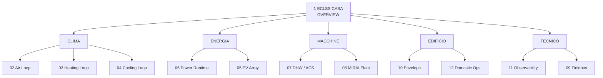

# AEB Dashboard Navigation

Status: architecture map + generated runtime graph tooling

Related decision: `docs/architecture/ADR-HA-DASH-001.md`

## Purpose

This document defines the human-readable navigation architecture for AEB dashboards. It does **not** duplicate Lovelace routes as a second source of truth.

The authoritative sources remain:

- `configuration.yaml` for registered dashboard IDs and files;
- `lovelace/*.yaml` for view paths and `navigation_path` targets.

The exact current graph is generated from those files with:

```powershell
pwsh -File ./ops/generate_dashboard_navigation.ps1
```

Output:

`docs/architecture/AEB_DASHBOARD_NAVIGATION.generated.md`

## Logical architecture



Text equivalent:

```text
                         1 ECLSS CASA
                            OVERVIEW
                                |
          +-------------+-------+-------+-----------+-------------+
          |             |               |           |             |
        CLIMA         ENERGIA        MACCHINE    EDIFICIO      TECNICO
          |             |               |           |             |
      02  03  04      06  05          07  08      10  12        11  09
```

### Category semantics

- **CLIMA**: air exchange, heating and cooling domains.
- **ENERGIA**: production, import/export, consumption and power runtime.
- **MACCHINE**: plant equipment with machine-specific operational views.
- **EDIFICIO**: building physics and building-level domestic operations. `Domestic Ops` remains here provisionally; if it grows into a broader operations domain it may become a first-level category through a future ADR.
- **TECNICO**: observability, contracts/readiness, raw fieldbus and forensic views.

## Navigation direction

The intended information flow follows ADR-HA-DASH-001:

```text
OVERVIEW -> DOMAIN / ENERGY / MACHINE -> OBSERVABILITY / FIELDBUS when deeper diagnosis is needed
```

The overview answers: **what is happening and where should I enter?**

A domain dashboard answers: **why is this domain acting and which controls are allowed?**

Observability answers: **is the system healthy, ready and contract-compliant?**

Fieldbus answers: **what do the raw links/registers actually report?**

Legacy/archive dashboards are not valid operational navigation targets.

## Dashboard 13 - AEB Stato casa TV

`13 AEB - Stato casa` is treated as a **presentation/HMI surface**, not as a child of the `EDIFICIO` category. It may provide a 10-foot operational view and safe navigation into the governed dashboard hierarchy, but its exact links are intentionally derived from the Lovelace YAML and shown in the generated graph.

This separation avoids confusing the physical building domain with a presentation channel.

## Generated graph contract

`ops/generate_dashboard_navigation.ps1` extracts:

1. dashboard ID -> Lovelace file from `configuration.yaml`;
2. dashboard -> registered view paths from each Lovelace YAML;
3. every `navigation_path`;
4. source dashboard/view -> target dashboard/view;
5. a Mermaid dashboard graph and two audit tables.

The generated file is disposable and may be regenerated at any time. Do not hand-edit it.

## CI / gate contract

`ops/gate_lovelace_dashboards.ps1` must fail when:

- a registered Lovelace file is missing;
- an operational Lovelace file is orphaned;
- a dashboard-like `navigation_path` points to an unregistered dashboard;
- a route points to a registered dashboard but to a view path that does not exist.

The gate warns, rather than fails, for isolated dashboards because some surfaces may intentionally be sidebar-only, presentation-only or under staged rollout.

## Change rule

When a dashboard ID, view path or `navigation_path` changes:

1. modify the YAML source;
2. run the Lovelace gate;
3. regenerate the graph;
4. inspect the Mermaid graph for unintended topology changes.

No route table should be maintained manually in this document.
